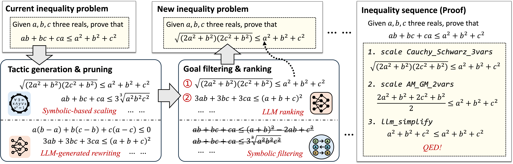
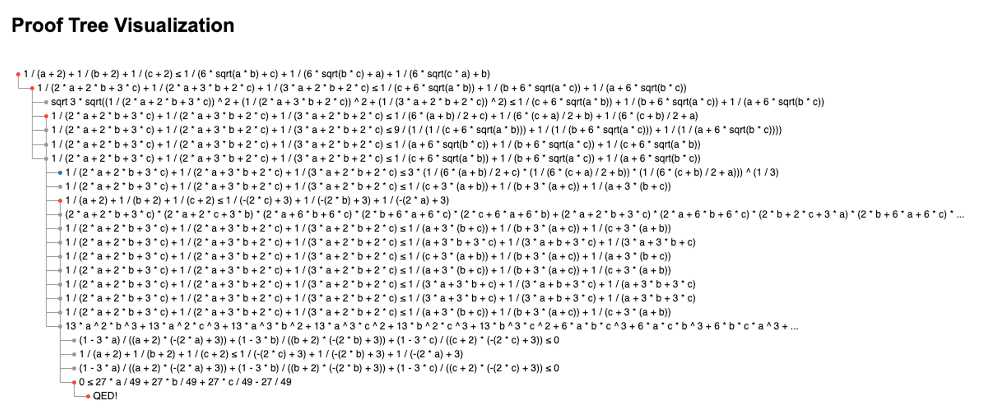

# Proving Olympiad Inequalities by Synergizing LLMs and Symbolic Reasoning

This is the official code for NeqLIPS, a powerful Olympiad-level Inequality Prover.



NeqLIPS first enumerates all possible scaling tactics using symbolic tools, and prompts LLMs to generate rewriting tactics. 
Then, it selects the best proof state by symbolic filtering and neural ranking.

For detailed information, please refer to our [research paper](#citation).

## Installation

#### 1. Clone the repository

```
git clone https://github.com/Lizn-zn/NeqLIPS.git 
cd NeqLIPS
```

#### 2. Install Lean 4 & Lean-REPL

Follow the instructions on the [Lean installation page](https://lean-lang.org/lean4/doc/setup.html) to install Lean 4. Then, install lean-repl via the following command.

```
git submodule init && git submodule update 
```

#### 3. Install dependencies

```
conda env create -f ./Installation/env.yml 
conda activate NeqLIPS 
pip install git+https://github.com/Lizn-zn/pysmt.git@Bottema 
pip install git+https://github.com/Lizn-zn/MT-Solver.git
```

#### 4. Install Rust & Egg

Follow the instructions on the [Rust installation page](https://www.rust-lang.org/tools/install) to install Rust. Then, install Egg via the following command.
```
cargo install maturin && maturin develop --release --manifest-path LIPS/egg_matching/Cargo.toml
```

#### 5. Install Symbolic Solver (Optional)

We strongly recommend installing one of the [maple](https://www.maplesoft.com/) or [mathematica](https://www.wolfram.com/mathematica/) for the counterexample checking

#### 6. Initialize the LLM interface

Set your own GPT-4 key by `export OPENAI_API_KEY="your_api_key_here"`

## Usage

#### 1. Run the Inequality Prover

Use either the provided shell script or run directly:

```bash
python prove.py --problem "theorem example_problem (a b c : ℝ) (ha : a > 0) (hb : b > 0) (hc : c > 0) (h : a + b + c = 1) : 1 / (a + 2) + 1 / (b + 2) + 1 / (c + 2) ≤ 1 / (6 * sqrt (a * b) + c) + 1 / (6 * sqrt (b * c) + a) + 1 / (6 * sqrt (c * a) + b) := by sorry"
```

**First-Time Setup**: Initial compilation of the lemma library takes approximately 20 minutes. Subsequent runs will be significantly faster.

**More arguments**: For a complete list of configuration options, refer to `LIPS/args.py`.

#### 2. Visualize the Proof Tree

Run the following command to visualize the proof tree.
```bash
python viz.py /path/to/proof_tree.json
```

Example proof tree visualization for the running example:




## Performance

Results on the MO-INT benchmark:

| Model | DeepSeek-R1 | GPT-o3mini | AIPS | NeqLIPS (w/o SOS) | NeqLIPS (w/ SOS) | 
| :---: | :---: | :---: | :---: | :---: | :---: |
| Success Rate | 20% | 15% | 50% | 80% | 90% |

NeqLIPS with sum-of-squares (SOS) successfully proves 18 out of 20 IMO-level problems. 
The formal proofs of MO-INT, ChenNEQ, and 567Neq are provided in `Neq/Math/Problem`.

## Extending NeqLIPS

#### 1. Add new rewriting tactics
- Location: `LIPS/Library/RewritingLib.json`
- Format:
    ```json
    {
        "REWRITE_NAME": {
            "prompt": "LLM prompt",
            "tactic": "Lean 4 tactic name",
            "type": "rewrite_without_assumption | rewrite_with_assumption | rewrite_with_inequation",
            "sym_only": "whether only use symbolic rewriting"
        }
    }
    ```
- Add corresponding Lean tactics in `Neq/math/Math/Tactics.lean`

#### 2. Add new scaling tactics

- Location: `LIPS/Library/ScalingLib.json`
- Format:
    ```json
    {
        "LEMMA_NAME": {
            "input": "Lemma_Input",
            "output": "Lemma_Output",
            "type": "Direction",
            "var": ["Var_List"],
            "condition": ["Equality_Condition"]
        }
    }
    ```
- Add corresponding Lean lemmas in `Neq/math/Math/NeqScales.lean`

## TODO List

- [ ] Update to `Lean v4.15.0` with macOS support
- [ ] Replace lean-repl with alternative solutions
- [ ] Implement local SFT model as GPT-4o alternative

## Questions and Bugs

If you have any questions, please feel free to reach out to us at [lizn@smail.nju.edu.cn](mailto:lizn@smail.nju.edu.cn) or submit an issue here.


## Citation

[Proving Olympiad Inequalities by Synergizing LLMs and Symbolic Reasoning](https://arxiv.org/abs/2502.13834)      
International Conference on Learning Representations (ICLR), 2025  
Zenan Li*, [Zhaoyu Li](https://www.zhaoyu-li.com/)*, Wen Tang, [Xian Zhang](https://www.microsoft.com/en-us/research/people/zhxian/), Yuan Yao, [Xujie Si](https://www.cs.toronto.edu/~six/), [Fan Yang](https://fanyangcs.github.io/), [Kaiyu Yang](https://yangky11.github.io/)†, [Xiaoxing Ma](https://ics.nju.edu.cn/people/xiaoxingma/)†  
(\* equal contribution; † equal advising)

```bibtex
@inproceedings{li2025lips,
  title={Proving Olympiad Inequalities by Synergizing {LLMs} and Symbolic Reasoning},
  author={Li, Zenan and Li, Zhaoyu and Tang, Wen and Zhang, Xian and Yao, Yuan and Si, Xujie and Yang, Fan and Yang, Kaiyu and Ma, Xiaoxing},
  booktitle={International Conference on Learning Representations (ICLR)},
  year={2025}
}
```
